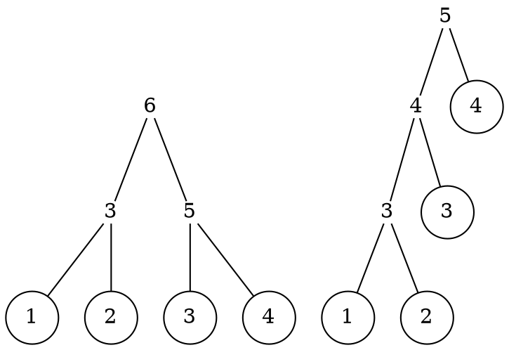

# 8章 Greedy algorithms on trees

@khibino

---

* 8.1 Minimum-height trees
* 8.2 Huffman coding trees
* 8.3 Priority queues

最初の 2つは最小のコストで木を構築するという問題

---

## 8.1 Minimum-height trees

* Minimum-height
* Minimum-cost

## Leaf labelled tree / size

リーフにラベルの付いた木

```haskell
data Tree a = Leaf a | Node (Tree a) (Tree a)
            deriving (Eq, Show)
```

サイズはリーフの数

```haskell
size :: Tree a -> Nat
size (Leaf x) = 1
size (Node u v) = size u + size v
```

---

## Leaf labelled tree / height

```haskell
data Tree a = Leaf a | Node (Tree a) (Tree a)
            deriving (Eq, Show)
```

高さ

```haskell
height (Leaf x) = 0
height (Node u v) = 1 + height u `max` height v
```

h < n ≤ 2^h ⇒ h ≥ ⌈ log n ⌉

---

## Leaf labbeled tree / fringe

```haskell
data Tree a = Leaf a | Node (Tree a) (Tree a)
            deriving (Eq, Show)
```

```haskell
fringe :: Tree a -> [a]
fringe (Leaf x) = [x]
fringe (Node u v) = fringe u ++ fringe v
```

以前にでてきた flatten と本質的には同じ

最小の木は `Leaf` なので `fringe` は常に空でないリスト

---

## Minimum-height trees / Halving

与えられたリストを fringe とし最小の高さの木を作る問題を考える

```haskell
mktree :: [a] -> Tree a
mktree [x] = Leaf x
mktree xs  = Node (mktree ys) (mktree zs)
  where (ys,zs) = splitAt (length xs `div` 2) xs
```

この方法は線形時間ではない

---

## Minimum-height trees / Bottom up

```haskell
mktree :: [a] -> Tree a
mktree = unwrap . until single (pairWith Node) . map Leaf
```

```haskell
unwrap :: [a] -> a
unwrap [x] = x

single :: [a] -> Bool
single [_] = True
single  _  = False

pairWith :: (a -> a -> a) -> [a] -> [a]
pairWith f [] = []
pairWith f [x] = [x]
pairWith f (x:y:xs) = f x y : pairWith f xs
```

---

## Minimum-height trees / minimum

```haskell
mktree :: [a] -> Tree a
mktree [x] = Leaf x
mktree xs  = Node (mktree ys) (mktree zs)
  where (ys,zs) = splitAt (length xs `div` 2) xs
```

```haskell
mktree :: [a] -> Tree a
mktree = unwrap . until single (pairWith Node) . map Leaf
```

2つの木の構築方法は異なる木を生成するが両方とも最小の高さを持つ

---

## Minimum-height trees / estimating

```haskell
mktree :: [a] -> Tree a
mktree [x] = Leaf x
mktree xs  = Node (mktree ys) (mktree zs)
  where (ys,zs) = splitAt (length xs `div` 2) xs
```

長さ n の入力の mktree の高さを `H(n)` とする

```math
H(1) = 0, H(n) = 1 + H(⌈n/2⌉)
H(n) = ⌈log n⌉
```

が成立する (練習問題 8.1)

---

## Minimum-cost trees

```haskell
cost :: Tree Nat -> Nat
cost (Leaf x) = x
cost (Node u v) = 1 + cost u `max` cost v
```

Leaf がラベル値であること以外は height と同じ定義

---

## Minimum-cost trees / figure

図 p.179 上

左の木
```
        6
       / \
      /   \
     /     \
    3       5
   / \     / \
  1   2   3   4
```

右の木
```
        5
       / \
      4   4
     / \
    3   3
   / \
  1   2
```

<!--

 -->

左の木はコスト 6、右の木はコスト 5 (最小コスト)

---

## Minimum-cost trees / spec

```haskell
mct :: [Nat] -> Tree Nat
mct xs ← MinWith cost (mktrees xs)
```

mktrees でできる木のうち、コストが最小のもの

```haskell
mktrees :: [a] -> [Tree a]
mktrees [x] = [Leaf x]
mktrees (x:xs) = concatMap (extend x) (mktrees xs)

extend :: a -> Tree a -> [Tree a]
extend x (Leaf y)   = [Node (Leaf x) (Leaf y)]
extend x (Node u v) = [Node (Leaf x) (Node u v)] ++
                      [Node u' v | u' <- extend x u]
```

---

## `mktrees` / example

図 p.179 下

```
    @
   / \
  @   t2
 / \
y   t1
```
<!--
  -->

から 3つの木が生成される

図 p.180 上

```
    @
   / \
  x   @
     / \
    @   t2
   / \
  y   t1


      @
     / \
    @   t2
   / \
  x   @
     / \
    y   t1


        @
       / \
      @   t2
     / \
    @   t1
   / \
  x   y
```
<!--
  -->

---

## `mktrees` / foldrn

`MinWith` は空リストでは定義されていないので、
入力を空でないリストに限定する

空ではないリストに対する十分に一般的な畳み込み関数

```haskell
foldrn :: (a -> b -> b) -> (a -> b) -> [a] -> b
foldrn f g [x]    = g x
foldrn f g (x:xs) = f x (foldrn f g xs)

mktrees = foldrn (concatMap . extend) (wrap . Leaf)

wrap :: a -> [a]
wrap x = [x]
```

---

## `mktrees` / with Forest

```haskell
type Forest a = [Tree a]

rollup :: [Tree a] -> Tree a
rollup = foldl1 Node

spine :: Tree a -> [Tree a]
spine (Leaf x)   = [Leaf x]
spine (Node u v) = spine u ++ [v]
```

Forest を木へと rollup

spine は rollup の逆

```
spine (rollup ts) = ts
```

---

## `mktrees` / with Forest

```haskell
mktrees :: [a] -> [Tree a]
mktrees = map rollup . mkforests

mkforests :: [a] -> [Forest a]
mkforests = foldrn (concatMap . extend) (wrap . wrap . Leaf)

extend :: a -> Forest a -> [Forest a]
extend x ts = [Leaf x : rollup (take k ts) : drop k ts | k <- [1 .. length ts] ]
```

この `extend` は前半部分の列を木へと rollup し、先頭に `Leaf` を追加する
foldrn で定義したものとは木を生成する順序が異なっている
Forest 版の mktrees はこの後では利用しないが紹介だけされている

---

## `mct` / foldrn fusion

```haskell
mct :: [Nat] -> Tree Nat
mct xs ← MinWith cost (mktrees xs)
```

```haskell
mktrees = foldrn (concatMap . extend) (wrap . Leaf)
```

foldrn の refinement バージョンの融合法則と context-sensitive fusion condition

```haskell
foldrn f2 g2 xs ← M (foldrn f1 g1 xs)
```

```haskell
g2 x ← M (g1 x) -- 一番目
f2 x (M (foldrn f1 g1 xs)) ← M (f1 x (foldrn f1 g1 xs)) -- 二番目
```

今回の問題では

```haskell
M = MinWith cost
f1 = concatMap . extend
g1 = wrap . Leaf
```

---

## `mct` / Second fusion condition

```haskell
mktrees = foldrn (concatMap . extend) (wrap . Leaf)
```

```haskell
f2 x (M (foldrn f1 g1 xs)) ← M (f1 x (foldrn f1 g1 xs))
```

```haskell
M = MinWith cost
f1 = concatMap . extend
g1 = wrap . Leaf
```

context-sensitive fusion condition の二番目に当てはめると

```haskell
gstep x (MinWith cost (mktrees xs))
    ← MinWith cost (concatMap (extend x) (mktrees xs))
```

---

## `mct` / Cost monotonicity


```haskell
gstep x (MinWith cost (mktrees xs))
    ← MinWith cost (concatMap (extend x) (mktrees xs))
```

これが成立するためには mktrees で構成される任意の t, t' について単調性が成立しなければならない
(前の章の最後)

cost t ≤ cost t' ⇒ cost (gstep x t) ≤ cost (gstep x t')

実はこの単調性を満たすような gstep は存在しない

---

## `mct` / Not monotone for cost

図 p.181 下 (t1, t2)

t1
```
      10
     /  \
    9    9
   / \
  5   8
     / \
    6   7
```

t2
```
       10
       / \
      8   9
     / \
    7   7
   / \
  5   6
```

図 p.182 上 (略)

t1, t2 は最小のコスト 10 を持つ

- t1 に 8 を加えると最小のコストは 11
- t2 に 8 を加えると最小のコストは 10

cost t1 ≤ cost t2 ⇒ cost (gstep x t1) ≤ cost (gstep x t2)

が成立しない

---

<!-- kokomade -->
<!-- kokokara -->
<!-- 4/4 は lexical cost の復習から -->

## `mct` / Lexical cost

t2 の lexical cost、 [10,8,7,5] は
t1 の lexical cost、 [10,9,5] より小さい

t1
```
      10
     /  \
    9    9
   / \
  5   8
     / \
    6   7
```

t2
```
       10
       / \
      8   9
     / \
    7   7
   / \
  5   6
```

---

## `mct` / `lcost` monotonicity

```
lcost ::Tree Nat -> [Nat]
lcost = reverse . scanl1 op . map cost . spine
  where op x y = 1 + (x `max` y)
```

lcost を t2 に適用する例:

spine のコスト ( [5,6,7,9] ) を累積 ( [5,7,8,10] ) して reverse

lcost を最小にすると cost も最小になる (なぜ?)
- lcost の先頭が cost になるからでは

context-sensitive fusion condition の二番目を次にように修正する

```haskell
gstep x (MinWith lcost (mktrees xs))
    ← MinWith lcost (concatMap (extend x) (mktrees xs))
```

lcost の場合は次を示すことができる

lcost t1 ≤ lcost t2 ⇒ lcost (gstep x t1) ≤ lcost (gstep x t2)

gstep を次のように定める

```haskell
gstep x ts ← MinWith lcost (extend x ts)
```

---

## Revised `gstep` construction

`gstep` の構成的な定義を考えつつ単調性が成立することを確認していく

次の 2つの木を考える

p.183 上  図8.1

左 - $[t_1,t_2,...,t_n]$ を rollup したもの

```
        c{n}
        /   \
     c{n-1} t{n}
      /  \
     /    \
    c2   t{n-1}
   /  \
  t1  t2
```

右 - 始めの $j$ 要素を rollup したあとに x を葉として加えたもの
```
        c'{n}
        /  \
       /    t{n}
    c'{j+1}
     /    \
   c'{j}  t{j+1}
   /  \
  x    c{j}
      /  \
     /    t{j}
    t1
```

---

## Monotonicity / Before adding leaf

$2 ≤ k ≤ n$ に対して次が成立し、$[c_1, c_2,...c_n]$ は厳密に増加する

$c_1 =$ cost $t_1$

$c_{k} = 1 + (c_{k-1}$ `max` cost $t_{k})$


```
         c{n}
        /   \
     c{n-1} t{n}
      /  \
     /    \
    c2   t{n-1}
   /  \
  t1  t2
```

---

## Monotonicity / After adding leaf

また、$j+1 ≤ k ≤ n$ に対して次が成立する

$c'_j = 1 + (x$ `max` $c_{j})$

$c'_k = 1 + (c'_{k-1}$ `max` cost $t_{k})$

```
        c'{n}
        /  \
       /    t{n}
    c'{j+1}
     /    \
   c'{j}  t{j+1}
   /  \
  x    c{j}
      /  \
     /    t{j}
    t1
```

新たな葉を加えてもコストを減らすことはできないので、
$j ≤ k ≤ n$ に対して $c_{k} ≤ c'_{k}$

---

## Minimum lcost / Example

$[c'_{n}, c'_{n-1},...,c'_{j}, x]$ を最小にするように $j$ を選ぶ

例:

コスト $[5,2,4,9,6]$ を持つ 5つの木 $[t_1,t_2,...,t_5]$ を考えてみる

$[c_1,c_2,...,c_5] = [5,6,7,10,11]$

x = 8 を加えるのに 5通りの方法がある

$[8,5,2,4,9,6] → [8,9,10,11,12,13]$

$[8,6,4,9,6] → [8,9,10,11,12]$

$[8,7,9,6] → [8,9,10,11]$

$[8,10,6] → [8,11,12]$

$[8,11] → [8,12]$

3番目のものが lcost が最小で、 $[11,10,9,8]$ ( $[8,9,10,11]$ の reverse)

---

## Minimum lcost / Adding leaf

$[c'_{n}, c'_{n-1},...,c'_{j}, x]$ を最小にするように $j$ を選ぶ

もっとも良い $j$ は次の条件を満たす最小の値だという主張

$1 + (x$ `max` $c_{j}) < c_{j+1}$   (8.1)

※ テキストにはないが、この式が出てくる理由が非自明だったので次で論証する

このような $j$ が無いときは $j = n$ を選択

---

## Condition to be $c'_{j+1} ≤ c_{j+1}$

$1 + (x$ `max` $c_{j}) < c_{j+1}$ を導出する

$x$ 追加後の木を考えると

$c'_{j} = 1 + (x$ `max` $c_{j})$

$c'_{j+1} = 1 + (c'_{j}$ `max` cost $t_{j+1})$

$x$ 追加後に $c'_{j+1}$ が $c_{j+1}$より大きくならない($c_{j+1}$以下になる)

$c'_{j+1} ≤ c_{j+1}$

⟹ { $c'_{j+1}$ の定義 }

$1 + (c'_{j}$ `max` cost $t_{j+1}) ≤ c_{j+1}$

⟹ { $1 + p ≤ q ⟹ p < q$ }

$(c'_{j}$ `max` cost $t_{j+1}) < c_{j+1}$

⟹ { $(p$ `max` $q) < r ⟹ p < r$ $⋀$ $q < r$ }

$c'_{j} < c_{j+1}$ $⋀$ cost $t_{j+1} < c_{j+1}$ -- 右側の成立は後述

⟹ { $c'_{j}$ の定義 }

$1 + (x$ `max` $c_{j}) < c_{j+1}$ -- 示したかった主張

x 追加前の木を考えると

$c_{j+1} = 1 + (c_{j}$ `max` cost $t_{j+1})$

⟹ { $p = 1 + q ⟹ p > q$ }

$c_{j+1} > (c_{j}$ `max` cost $t_{j+1})$

⟹ { $p > (q$ `max` $r) ⟹ p > r$ }

cost $t_{j+1} < c_{j+1}$

---

## Minimum lcost / Example again

$[c_1,c_2,c_3,c_4,c_5] = [5,6,7,10,11]$

このケースに $x = 8$ を加えるとき
(8.1) を満たす最小の $j$ は $j = 3$ で結果は次のようになる

$[x,1+(x$ `max` $c_3),c_4,c_5] = [8,9,10,11]$

同じのケースに代わりに $x = 9$ を加えるとき
$j = 5$ で結果は次のようになる

$[x,1 + (x$ `max` $c_5)] = [9,12]$

---

## Proof of smallest $j$ property

(8.1) の最小の $j$ の主張を証明する

$1 ≤ j < k < n$ において $j$ と $k$ が両方とも (8.1) を満たすことを仮定

$c'_{j} = 1+(x$ `max` $c_{j})$ , $c'_{k} = 1 + (x$ `max` $c_{k})$ とすると

$as = [x,c'_{j},c_{j+1},...,c_{k-1},c_{k},c_{k+1},...,c_{n}]$

$bs = [x,c'_{k},c_{k+1},...,c_{n}]$

において $c_{k} < c'_{k}$ から `reverse as` $<$ `reverse bs` となる。

よって、より小さい $j$ の方が最小のコストとなる。

---

## Monotonicity of `gstep` on lcost / prereq

`lcost` について `gstep x` が単調であることを示すために次を仮定する

lcost $t_1 = [c_{n},c_{n-1},...,c_1]$

lcost $t_2 = [d_{m},d_{m-1},...,d_1]$

where lcost $t_1$ $≤$ lcost $t_2$

lcost $t_1$ $=$ lcost $t_2$ のときには両方に新たな葉を加えてもコストが等しい

lcost $t_1$ $<$ lcost $t_2$ なら共通の接頭辞(長さ$k$)を削除し、2つの木 $t'_1$ $t'_2$ が残る

lcost $t'_1 = [c_{p},...,c_1]$

lcost $t'_2 = [d_{q},...,d_1]$

where $p = n-k ⋀ q = m-k ⋀ c_{p} < d_{q}$

これで lcost (gstep $x$ $t'_1$) $≤$ lcost (gstep $x$ $t'_2$) を示す準備ができた

---

## Monotonicity of `gstep` on lcost

第一に $t'_1$ と $j < p$ について (8.1) を仮定する。このとき

lcost (gstep $x$ $t'_1$) $=$ $[c_{p},...,c_{j+1},1+(x$ `max` $c_{j}),x]$

しかし $c_{p} < d_{q}$ なので、 gstep $x$ $t'_2$ ができるのは $t'_2$ コストを増やすことのみなので、次が成立する

lcost (gstep $x$ $t'_1$) $<$ lcost $t'_2$ $≤$ lcost (gstep $x$ $t'_2$)

第二に (8.1) が $t'_1$ について成り立たないと仮定する。このとき

lcost (gstep $x$ $t'_1$) $=$ $[1 + (x$ `max` $c_{p}),x]$

よって、次の場合のいずれか

$1 + (x$ `max` $c_{p}) < d_{q}$ の場合

lcost (gstep $x$ $t'_1$) $<$ lcost $t'_2$ $≤$ lcost (gstep $x$ $t'_2$)

$1 + (x$ `max` $c_{p}) ≥ d_{q}$ の場合

$x ≥ d_{q} - 1$  $⋀$ $1 + (x$ `max` $d_{q-1}) ≥ d_{q}$

※ そもそも $x ≥ d_{q} - 1$ が非自明

※ テキストには無いが $1 + (x$ `max` $d_{q-1}) ≥ d_{q}$ の成立が非自明だった次で論証する

この意味するところは (8.1) が $t'_2$ についても成り立たないということ


lcost (gstep $x$ $t'_1$) $=$ $[1+ (x$ `max` $c_{p}),x]$ $≤$

$[1+ (x$ `max` $d_{q}),x]$ $=$ lcost (gstep $x$ $t'_2$)

これで単調性の証明が完了した

---

## $x ≥ d_q - 1$ / counter example

以下の場合を考える。

$t'_1 =$ rollup (map Leaf [2,2,3])
```
      4
     / \
    3   3
   / \
  2   2
```

$t'_2 =$ rollup (map Leaf [2,2,4])
```
      5
     / \
    3   4
   / \
  2   2
```

このとき

$[c_3,c_2,c_1] = [4,3,2], p = 3$

$[d_3,d_2,d_1] = [5,3,2], q = 3$

となり $c_3 < d_3$ ( $4 < 5$ ) が成立している。

ここに $x = 2$ を加える。

すると

$1 + (2$ `max` $c_1) < c_2$ ( $1 + (2$ `max` $2) < 3$ ) および

$1 + (2$ `max` $c_2) < c_3$ ( $1 + (2$ `max` $3) < 4$ ) が成立しないため

(8.1) が $t'_1$ について成り立たない場合となっている。

ここでさらに $1 + (x$ `max` $c_p) ≥ d_q$ ( $1 + (2$ `max` $4) ≥ 5$ ) の場合にあたることが分かるが、

このとき $x ≥ d_q - 1$ ( $2 ≥ 5 - 1$ ) は成立しない

---

## Monotonicity of `gstep` on lcost / Lemma

$x ≥ d_{q} - 1$ から $1 + (x$ `max` $d_{q-1}) ≥ d_{q}$ を示す

{ $d_{q}$ の定義 }
$d_{q} = 1 + (d_{q-1}$ `max` cost $t_{q})$

$x ≥ d_{q} - 1$

⟺ { 元の式を残す, $d_{q}$ の定義 }

$x ≥ d_{q} - 1$ $⋀$ $x$ $≥$ $(d_{q-1}$ `max` cost $t_{q})$

⟹ { $(a$ `max` $b)$ $≥$ $a$ | $a$ <- $d_{q-1}$, $b$ <- cost $t_{q}$ }

$x ≥ d_{q} - 1$ $⋀$ $x$ $≥$ $(d_{q-1}$ `max` cost $t_{q})$ $≥$ $d_{q-1}$

⟹ { 推移律 $≥$  }

$x ≥ d_{q} - 1$ $⋀$ $x ≥ d_{q-1}$

⟹ { $a ≥ b$ から $a$ $=$ $(a$ `max` $b)$ | $a$ <- $x$, $b$ <- $d_{q-1}$ }

$x ≥ d_{q} - 1$ $⋀$ $x$ $=$ $(x$ `max` $d_{q-1})$

⟹ { rewrite | $x$ $=$ $(x$ `max` $d_{q-1})$ }

$(x$ `max` $d_{q-1})$ $≥$ $d_{q} - 1$

⟺ { 両辺 $+1$ }

$1 + (x$ `max` $d_{q-1})$ $≥$ $d_{q}$

---

## Condition of `gstep`

`gstep` の実装が満たすべき条件

(8.1) から

$1 + (x$ `max` $c_{j})$ $<$ $c_{j+1}$ ⟺

$1 + (x$ `max` $c_{j})$ $<$ $1+ (c_{j}$ `max` cost $t_{j+1})$ ⟺

$(x$ `max` $c_{j})$ $<$ cost $t_{j+1}$

この条件を満たすように `gstep` を与える

```
gstep :: Nat -> Tree Nat -> Tree Nat
gstep x = rollup . add x . spine

add x ts = Leaf x : join x ts
join x [u] = [u]
join x (u:v:ts) = if x `max` cost u < cost v
                  then u:v:ts else join x (Node u v : ts)
```

join は x や後続の木のコストと同じくらいのコストになるまで木をまとめる

※ $(c_{j}$ `max` cost $t_{j+1})$ = cost $t_{j+1}$ が仮定されているが、成立が非自明だったので次で論証する

---

## Condition of `gstep` / Lemma

{ $(a$ `max` $b)$ $=$ $a$ $⋁$ $(a$ `max` $b)$ $=$ $b$
| $a$ <- $c_{j}$, $b$ <- cost $t_{j+1}$ }

$(c_{j}$ `max` cost $t_{j+1})$ $=$ cost $t_{j+1}$ $⋁$ $(c_{j}$ `max` cost $t_{j+1})$ $=$ $c_{j}$

   $(c_{j}$ `max` cost $t_{j+1})$ $=$ $c_{j}$ が偽であることを示す

{ (8.1) 書き換えの2行目 }

$1 + (x$ `max` $c_{j})$ $<$ $1 + (c_{j}$ `max` cost $t_{j+1})$

⟺ { 両辺 $- 1$ }

$(x$ `max` $c_{j})$ $<$ $(c_{j}$ `max` cost $t_{j+1})$

⟺ { rewrite | $(c_{j}$ `max` cost $t_{j+1})$ $=$ $c_{j}$ }

$(x$ `max` $c_{j})$ < $c_{j}$

⟺ { $b$ $≤$ $(a$ `max` $b)$ }

$c_{j}$ $≤$ $x$ `max` $c_{j}$ $<$ $c_{j}$

⟹ { $≤$ と $<$ の推移則 }

$c_{j}$ $<$ $c_{j}$

⟹ { $<$ の場合の枯渇 }

$∅$ (False)

<!-- kokomade -->
<!-- kokokara -->
<!-- 5/9 は rollup Fission の始めから -->
<!-- $x ≥ d_{q} - 1 はできれば示す -->

---

## rollup / Fission condition

それぞれの段階で rollup しているのを最後に一度だけにする

```haskell
foldrn gstep Leaf = rollup . foldrn hstep g
```
foldrn の融合法則を分解する方向に使う

このような hstep と g を見つける

```haskell
foldrn gstep Leaf [x] = rollup (foldrn hstep g [x])
-- 両辺を展開
Leaf x = rollup (g x)
-- ポイントフリー
Leaf = rollup . g
```
rollup [Leaf x] = Leaf x なので g = wrap . Leaf とできる

```haskell
rollup (foldrn hstep g (x:xs)) = foldrn gstep Leaf (x:xs)
-- 両辺を展開
rollup (hstep x (foldrn hstep g xs)) = gstep x (foldrn gstep Leaf xs)
-- 帰納法の仮定 rollup (foldrn hstep g xs) = foldrn gstep Leaf xs
rollup (hstep x (foldrn hstep g xs)) = gstep x (rollup (foldrn hstep g xs))
-- ts = foldrn hstep g xs とすると
rollup (hstep x ts) = gstep x (rollup ts)
```

---

## rollup / Fission

任意の `x` と `ts` = foldrn hstep g xs の形をしている任意の `ts` について要求される

```haskell
-- ts = foldrn hstep g xs とすると
rollup (hstep x ts) = gstep x (rollup ts)
```

右辺は、条件付きで次のように変換できる

```haskell
    gstep x (rollup ts)
  = { gstep の定義 }
    rollup (add x (spine (rollup ts)))
  = { ts の最初の要素が葉なら }
    rollup (add x ts)
```

( spine (rollup ts) = ts は以前に出てきたときに言及が無かったが、成立には条件が必要 )

よって、 `ts` の最初の要素が葉であるという条件下で hstep = add を取れる

xs に対して ts = foldrn add (wrap . Leaf) xs だと、add の定義から ts の最初の要素が葉になる

```haskell
add x ts = Leaf x : join x ts
```

mct を以下で定義できる
```haskell
mct = rollup . foldrn add (wrap . Leaf)
```
この融合法則による分解を終えた段階で、 lcost を考えなくともよくなっている

---

## Eliminate repeated evaluation of `cost`

コストを繰り返し評価する部分を forest のそれぞれの木にペアで付加することで削除できる

```haskell
type Pair = (Tree Nat,Nat)
mct :: [Nat] ->  Tree Nat
mct = rollup . map fst . foldrn hstep (wrap . leaf)
hstep :: Nat ->  [Pair] ->  [Pair]
hstep x ts = leaf x : join x ts
join :: Nat -> [Pair] -> [Pair]
join x [u] = [u]
join x (u:v:ts) = if x `max` snd u < snd v
                  then u:v:ts else join x (node u v:ts)
-- スマートコンストラクタ
leaf :: Nat -> Pair
leaf x = (Leaf x,x)
node :: Pair ->  Pair ->  Pair
node (u,c) (v,d) = (Node u v, 1 + c `max` d)
```

## Greedy algorithm `mct` / example

アルゴリズムをリスト `[5,3,1,4,2]` に適用すると次のような forest を生成する

```haskell
[Leaf 2]
[Leaf 4,Leaf 2]
[Leaf 1,Node (Leaf 4) (Leaf 2)]
[Leaf 3,Leaf 1,Node (Leaf 4) (Leaf 2)]
[Leaf 5,Node (Node (Leaf 3) (Leaf 1)) (Node (Leaf 4) (Leaf 2))]
```
この forest を `rollup` すると次の木になる

図 p.186 下
```
   /\
  5  \
     /\
    /  \
   /    \
  /\    /\
 3  1  4  2
```
---

## Estimate running time of `mct`

長さ $n$ のリストに適用され、長さ $m$ の forest を返すような hstep 操作の任意の列が
最大でも $2n - m$ の join の呼び出しを含むことを帰納法によって証明できる

ベースケースは、$n = 1$ かつ $m = 1$

帰納法のステップ: 長さ $m'$ のリストに適用され、長さ $m$ のリストを返す join が $m'-m$ 回呼び出される

帰納法の仮定の適用: 長さ $n - 1$ のリストに適用され、長さ $m'$ の forest を返す hstep が最大でも $2(n-1)-m'$ の join の呼び出しを含む

長さ $n$ リストのリストに適用され、長さ $m$ の forest を返す hstep は最大でも次の回数の join の呼び出しを含み、帰納法が成立する

$(2 (n - 1) - m')  + 1 + (m' - m) ≤ 2n - m$

このアルゴリズムは fringe の長さに対する線形時間を消費する

---

## Final remark

fringe の要素がすべて 0 のリストのとき最小コスト木は最小高さ木を構築する

コストが木の高さであるときにも、(少し変更した)貪欲アルゴリズムがうまく動作する(演習問題)

---

## 8.2 Huffman coding trees


## coding example

```
  't' ⟼  0
  'e' ⟼  10
  'x' ⟼  11

  "text" ⟼ 010110
```

```
  't' ⟼  0
  'e' ⟼  10
  'x' ⟼  1

   "text" ⟼ 01010
   "tee"  ⟼ 01010
```

どの符号も他の符号の接頭辞とならない
prefix-free coding

---

## prefix-free coding

```
Node (Node (Leaf 'b') (Leaf 'e')) (Leaf 't')
```

```
       @
     0/ \1
	 @  't'
   0/ \1
  'b' 'e'

   'b' ⟼ 00
   'e' ⟼ 01
   't' ⟼ 1
```

---

## minimised length

$1 ≤ j ≤ n$ に対して文字 $c_{j}$ の出現頻度が $p_{j}$ のときの符号の長さを $l_{j}$ とする

$Σ_{j=1}^{n}\ p_{j}・l_{j}$ を最小にしたい

---

## Huffman coding

ハフマン符号化の4つの要素のうち木を構築する問題だけをあつかう

1. 標本から情報を集める
1. 二分木を構築する
1. テキストを符号化する
1.  ビット列を復号化する

---

## coding tree - weight, depth, cost

$1 ≤ j ≤ n$ に対して $c_{j}$ は文字で $w_{j}$ は重み

$[(c_1,w_1),(c_2,w_2),...,(c_n,w_n)]$

頻度は $w_{j}/W$、 ここで $W = Σ w_{j}$

$w_1 ≤ w_2 ≤...≤ w_n$ を想定

```haskell
depths :: Tree a -> [Nat]
depths = from 0
         where from n (Leaf x) = [n]
               from n (Node u v) = from (n+1) u ++ from (n+1) v

type Weight = Nat
type Elem = (Char,Weight)
type Cost = Nat

cost ::Tree Elem -> Cost
cost t = sum [w * d | ((_,w),d) <- zip (fringe t) (depths t)]
```

## coding tree - permutation

```haskell
  huffman :: [Elem] -> Tree Elem
  huffman <- MinWith cost mktrees
```

mktrees は fringe として与えられたリストでのすべての木を生成する

実は fringe の順列が必要

fringe が [1,2,3] の順列である木にうち、順序無しの木で異なるもの

```
  Node (Node (Leaf 1) (Leaf 2)) (Leaf 3)
  Node (Node (Leaf 1) (Leaf 3)) (Leaf 2)
  Node (Node (Leaf 2) (Leaf 3)) (Leaf 1)
```

## unordered example

重み順の四つの木
```
  [Leaf 3,Leaf 5,Leaf 8,Leaf 9]
```

一番目と三番目を結合、重み順を維持し最後に置かれる
```
  [Leaf 5,Leaf 9,Node (Leaf 3) (Leaf 8)]
```

最初の二つを結合
```
  [Node (Leaf 3) (Leaf 8),Node (Leaf 5) (Leaf 9)]
```

残りの二つの木を結合
```
  [Node (Node (Leaf 3) (Leaf 8)) (Node (Leaf 5) (Leaf 9))]
```

## implementation details

mkforests は forest のリストを構築し、それぞれの forest は単一の木
```haskell
mktrees :: [Elem] -> [Tree Elem]
mktrees = map unwrap . mkforests . map Leaf

mkforests :: [Tree Elem] -> [Forest Elem]
mkforests = until (all single) (concatMap combine) . wrap
```

insert は重さの順を保つように木を木のリストへと挿入する。(insert 定義は演習問題)
picks は一章で定義された。
combine は可能なすべての方法で木の対を forest から選び、新たな木へと結合し、残りの木々へと挿入する
```haskell
combine :: Forest Elem  -> [Forest Elem]
combine ts = [insert (Node t1 t2) us | ((t1,t2),us) <- pairs ts]
pairs :: [a] -> [((a,a),[a])]
pairs xs = [((x,y),zs) | (x,ys) <- picks xs, (y,zs) <- picks ys]
```

## another implementation of mkforests

apply の定義は演習問題 1.13、
apply n は与えられた値に関数を n 回適用する
```
apply :: Nat -> (a -> a) -> a -> a
apply n f = if n == 0 then id else f . apply (n - 1) f

mkforests :: [Tree Elem] -> [Forest Elem]
mkforests ts = apply (length ts - 1) (concatMap combine) [ts]
```

## huffman coding fusion

```
  huffman :: [Elem] -> Tree Elem
  huffman <- MinWith cost mktrees
```

空でないリスト xs に対して次のような gstep を見つける
```
  unwrap (until single gstep (map Leaf xs)) <- MinWith cost (mktrees xs)
```

より一般的には、次ようなgstep を有限の空でない木のリスト ts に対して見つける
```
  unwrap (until single gstep ts) <- MinWith cost (map unwrap (mkforests ts))
```

<!-- kokomade -->
<!-- kokokara -->
<!-- 5/22 は Another generic greedy algorithm の始めから -->

## Another generic greedy algorithm

状態から候補のリストが次のような関数で与えられる状況
```haskell
  candidates :: State -> [Candidate]

// ハフマン符号化では、状態は木のリストで候補は複数の木
  candidates ts = map unwrap (mkforests ts)
```

つぎの精緻化がすべての状態 sx に対して保持される条件とは?
```
  extract (until final gstep sx) <- MinWith cost (candidates sx)   (8.2)
```

```haskell
  gstep :: State -> State
  final :: State -> Bool
  extract :: State -> Candidate
```

(8.2) は、任意の初期状態 sx に対して繰り返し貪欲ステップを適用することで、結果として最終状態になり、
その最終状態から、最小コストを持つ candidates sx にある候補 x を取り出すことができるということ

## first condition

```
  MCC sx = MinWith cost (candidates sx)
  mincost sx = minimum (map cost (candidates sx))
```

candidates sx 内のすべての x に対して、次が成立
```
  x <- MCC sx ⟺ cost x = mincost sx
```

(8.2) を保証する二つの条件の一つ目

```
  final sx ⟹ extract sx <- MCC sx   (8.3)
```

この条件はハフマン符号化を保つ為のもの。

このとき final = single かつ extract = unwrap

なぜなら map unwrap (mkforests [t]) = [t] かつ MinWith cost [t] = t

## second condition

(8.2) を保証する二つの条件の二つ目は貪欲条件

記述には二通りの方法がある

```
  not (final sx) ⟹ (∃x:x <- MCC (gstep sx) ⋀ x <- MCC sx)   (8.4)
```

```
  not (final sx) ⟹ MCC (gstep sx) <- MCC sx   (8.5)
```

特別な条件があれば (8.4) は (8.5) を導出する

gstep を適用することで候補の数が減り、新たなものが導入されない
```
  candidates (gstep sx) ⊆ candidates sx   (8.6)
```

## derivation for (8.5)

x <- MCC (gstep sx) かつ x <- MCC sx とすると MMC と mincost の定義から、次を得る
```
  mincost (gstep sx) = cost x = mincost sx
```

y <- MCC (gstep sx) とするなら (8.6) から y ∈ candidates sx
```
  cost y = mincost (gstep sx) = mincost sx
```

よって y <- MCC sx

## proof for (8.2)

(8.2) を証明するために、apply k gstep sx が最終状態であるような
最小の整数 kを考える。
```
  until final gstep sx = apply k gstep sx
```

$0 ≤ j < k$ について apply j gstep sx は最終状態ではないので、
より強い貪欲条件によって次を得る。
```
  MCC (apply (j+1) gstep sx) <- MCC (apply j gstep sx)
```

よって `MCC (apply k gstep sx) <- MCC sx` となる

さらに (8.3) から次が得られるので
```
  extract (apply k gstep sx) <- MCC (apply k gstep sx)
```

(8.2) が成立。

## Huffman coding continued
