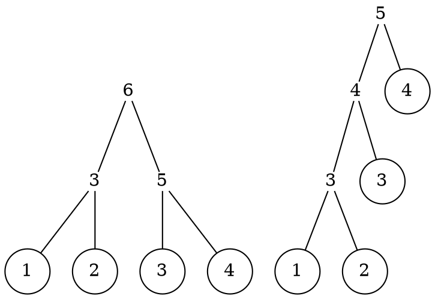

# 8章 Greedy algorithms on trees

@khibino

---

* 8.1 Minimum-height trees
* 8.2 Huffman coding trees
* 8.3 Priority queues

最初の 2つは最小のコストで木を構築するという問題

---

## 8.1 Minimum-height trees

* Minimum-height
* Minimum-cost

## Leaf labelled tree / size

リーフにラベルの付いた木

```haskell
data Tree a = Leaf a | Node (Tree a) (Tree a)
            deriving (Eq, Show)
```

サイズはリーフの数

```haskell
size :: Tree a -> Nat
size (Leaf x) = 1
size (Node u v) = size u + size v
```

---

## Leaf labelled tree / height

```haskell
data Tree a = Leaf a | Node (Tree a) (Tree a)
            deriving (Eq, Show)
```

高さ

```haskell
height (Leaf x) = 0
height (Node u v) = 1 + height u `max` height v
```

h < n ≤ 2^h ⇒ h ≥ ⌈ log n ⌉

---

## Leaf labbeled tree / fringe

```haskell
data Tree a = Leaf a | Node (Tree a) (Tree a)
            deriving (Eq, Show)
```

```haskell
fringe :: Tree a -> [a]
fringe (Leaf x) = [x]
fringe (Node u v) = fringe u ++ fringe v
```

以前にでてきた flatten と本質的には同じ

最小の木は `Leaf` なので `fringe` は常に空でないリスト

---

## Minimum-height trees / halving

与えられたリストを fringe とし最小の高さの木を作る問題を考える

```haskell
mktree :: [a] -> Tree a
mktree [x] = Leaf x
mktree xs  = Node (mktree ys) (mktree zs)
  where (ys,zs) = splitAt (length xs `div` 2) xs
```

この方法は線形時間ではない

---

## Minimum-height trees / bottom up

```haskell
mktree :: [a] -> Tree a
mktree = unwrap . until single (pairWith Node) . map Leaf
```

```haskell
unwrap :: [a] -> a
unwrap [x] = x

single :: [a] -> Bool
single [_] = True
single  _  = False

pairWith :: (a -> a -> a) -> [a] -> [a]
pairWith f [] = []
pairWith f [x] = [x]
pairWith f (x:y:xs) = f x y : pairWith f xs
```

---

## Minimum-height trees / minimum

```haskell
mktree :: [a] -> Tree a
mktree [x] = Leaf x
mktree xs  = Node (mktree ys) (mktree zs)
  where (ys,zs) = splitAt (length xs `div` 2) xs
```

```haskell
mktree :: [a] -> Tree a
mktree = unwrap . until single (pairWith Node) . map Leaf
```

2つの木の構築方法は異なる木を生成するが両方とも最小の高さを持つ

---

## Minimum-height trees / estimating

```haskell
mktree :: [a] -> Tree a
mktree [x] = Leaf x
mktree xs  = Node (mktree ys) (mktree zs)
  where (ys,zs) = splitAt (length xs `div` 2) xs
```

長さ n の入力の mktree の高さを `H(n)` とする

```math
H(1) = 0, H(n) = 1 + H(⌈n/2⌉)
H(n) = ⌈log n⌉
```

が成立する (練習問題 8.1)

---

## Minimum-cost trees

```haskell
cost :: Tree Nat -> Nat
cost (Leaf x) = x
cost (Node u v) = 1 + cost u `max` cost v
```

Leaf がラベル値であること以外は height と同じ定義

---

## Minimum-cost trees / figure

図 p.179 上

左の木
```
        6
       / \
      /   \
     /     \
    3       5
   / \     / \
  1   2   3   4
```

右の木
```
        5
       / \
      4   4
     / \
    3   3
   / \
  1   2
```

<!--

 -->

左の木はコスト 6、右の木はコスト 5 (最小コスト)

---

## Minimum-cost trees / spec

```haskell
mct :: [Nat] -> Tree Nat
mct xs ← MinWith cost (mktrees xs)
```

mktrees でできる木のうち、コストが最小のもの

```haskell
mktrees :: [a] -> [Tree a]
mktrees [x] = [Leaf x]
mktrees (x:xs) = concatMap (extend x) (mktrees xs)

extend :: a -> Tree a -> [Tree a]
extend x (Leaf y)   = [Node (Leaf x) (Leaf y)]
extend x (Node u v) = [Node (Leaf x) (Node u v)] ++
                      [Node u' v | u' <- extend x u]
```

---

## mktrees / example

図 p.179 下

```
    @
   / \
  @   t2
 / \
y   t1
```
<!--
  -->

から 3つの木が生成される

図 p.180 上

```
    @
   / \
  x   @
     / \
    @   t2
   / \
  y   t1


      @
     / \
    @   t2
   / \
  x   @
     / \
    y   t1


        @
       / \
      @   t2
     / \
    @   t1
   / \
  x   y
```
<!--
  -->

---

## mktrees / foldrn

`MinWith` は空リストでは定義されていないので、
入力を空でないリストに限定する

空ではないリストに対する十分に一般的な畳み込み関数

```haskell
foldrn :: (a -> b -> b) -> (a -> b) -> [a] -> b
foldrn f g [x]    = g x
foldrn f g (x:xs) = f x (foldrn f g xs)

mktrees = foldrn (concatMap . extend) (wrap . Leaf)

wrap :: a -> [a]
wrap x = [x]
```

---

## mktrees / with Forest

```haskell
type Forest a = [Tree a]

rollup :: [Tree a] -> Tree a
rollup = foldl1 Node

spine :: Tree a -> [Tree a]
spine (Leaf x)   = [Leaf x]
spine (Node u v) = spine u ++ [v]
```

Forest を木へと rollup

spine は rollup の逆

```
spine (rollup ts) = ts
```

---

## mktrees / with Forest

```haskell
mktrees :: [a] -> [Tree a]
mktrees = map rollup . mkforests

mkforests :: [a] -> [Forest a]
mkforests = foldrn (concatMap . extend) (wrap . wrap . Leaf)

extend :: a -> Forest a -> [Forest a]
extend x ts = [Leaf x : rollup (take k ts) : drop k ts | k <- [1 .. length ts] ]
```

この `extend` は前半部分の列を木へと rollup し、先頭に `Leaf` を追加する
foldrn で定義したものとは木を生成する順序が異なっている
Forest 版の mktrees はこの後では利用しないが紹介だけされている

---

## mct / foldrn fusion

```haskell
mct :: [Nat] -> Tree Nat
mct xs ← MinWith cost (mktrees xs)
```

```haskell
mktrees = foldrn (concatMap . extend) (wrap . Leaf)
```

foldrn の refinement バージョンの融合法則と context-sensitive fusion condition

```haskell
foldrn f2 g2 xs ← M (foldrn f1 g1 xs)
```

```haskell
g2 x ← M (g1 x) -- 一番目
f2 x (M (foldrn f1 g1 xs)) ← M (f1 x (foldrn f1 g1 xs)) -- 二番目
```

今回の問題では

```haskell
M = MinWith cost
f1 = concatMap . extend
g1 = wrap . Leaf
```

---

## mct / second fusion condition

```haskell
mktrees = foldrn (concatMap . extend) (wrap . Leaf)
```

```haskell
f2 x (M (foldrn f1 g1 xs)) ← M (f1 x (foldrn f1 g1 xs))
```

```haskell
M = MinWith cost
f1 = concatMap . extend
g1 = wrap . Leaf
```

context-sensitive fusion condition の二番目に当てはめると

```haskell
gstep x (MinWith cost (mktrees xs))
    ← MinWith cost (concatMap (extend x) (mktrees xs))
```

---

## mct / cost monotonicity


```haskell
gstep x (MinWith cost (mktrees xs))
    ← MinWith cost (concatMap (extend x) (mktrees xs))
```

これが成立するためには mktrees で構成される任意の t, t' について単調性が成立しなければならない
(前の章の最後)

cost t ≤ cost t' ⇒ cost (gstep x t) ≤ cost (gstep x t')

実はこの単調性を満たすような gstep は存在しない

---

## mct / not monotone for cost

図 p.181 下 (t1, t2)

t1
```
      10
     /  \
    9    9
   / \
  5   8
     / \
    6   7
```

t2
```
       10
       / \
      8   9
     / \
    7   7
   / \
  5   6
```

図 p.182 上 (略)

t1, t2 は最小のコスト 10 を持つ

- t1 に 8 を加えると最小のコストは 11
- t2 に 8 を加えると最小のコストは 10

cost t1 ≤ cost t2 ⇒ cost (gstep x t1) ≤ cost (gstep x t2)

が成立しない

---

<!-- kokomade -->
<!-- kokokara -->
<!-- 4/4 は lexical cost の復習から -->

## mct / lexical cost

t2 の lexical cost、 [10,8,7,5] は
t1 の lexical cost、 [10,9,5] より小さい

t1
```
      10
     /  \
    9    9
   / \
  5   8
     / \
    6   7
```

t2
```
       10
       / \
      8   9
     / \
    7   7
   / \
  5   6
```

---

## mct / lcost monotonicity

```
lcost ::Tree Nat -> [Nat]
lcost = reverse . scanl1 op . map cost . spine
  where op x y = 1 + (x `max` y)
```

lcost を t2 に適用する例: spine のコスト ( [5,6,7,9] ) を累積 ( [5,7,8,10] ) して reverse

lcost を最小にすると cost も最小になる (なぜ?)
- lcost の先頭が cost になるからでは

context-sensitive fusion condition の二番目を次にように修正する

```haskell
gstep x (MinWith lcost (mktrees xs))
    ← MinWith lcost (concatMap (extend x) (mktrees xs))
```

lcost の場合は次を示すことができる

lcost t1 ≤ lcost t2 ⇒ lcost (gstep x t1) ≤ lcost (gstep x t2)

gstep を次のように定める

```haskell
gstep x ts ← MinWith lcost (extend x ts)
```

---

## revised gstep monotonicity

新たな gstep の定義では単調性が成立することを確認する

p.183 上  図8.1

左 - $[t_1,t_2,...,t_n]$ を rollup したもの

```
        c{n}
        /   \
     c{n-1} t{n}
      /  \
     /    \
    c2   t{n-1}
   /  \
  t1  t2
```

右 - 始めの $j$ 要素を rollup したあとに x を葉として加えたもの
```
        c'{n}
        /  \
       /    t{n}
    c'{j+1}
     /    \
   c'{j}  t{j+1}
   /  \
  x    c{j}
      /  \
     /    t{j}
    t1
```

## monotonicity / before adding leaf

$2 ≤ k ≤ n$ に対して次が成立し、$[c_1, c_2,...c_n]$ は厳密に増加する

$c_1 =$ cost $t_1$

$c_{k} = 1 + (c_{k-1}$ `max` cost $t_{k})$


```
         c{n}
        /   \
     c{n-1} t{n}
      /  \
     /    \
    c2   t{n-1}
   /  \
  t1  t2
```

---

## monotonicity / after adding leaf

また、$j+1 ≤ k ≤ n$ に対して次が成立する

$c'_j = 1 + (x$ `max` $c_{j})$

$c'_k = 1 + (c'_{k-1}$ `max` cost $t_{k})$

```
        c'{n}
        /  \
       /    t{n}
    c'{j+1}
     /    \
   c'{j}  t{j+1}
   /  \
  x    c{j}
      /  \
     /    t{j}
    t1
```

新たな葉を加えてもコストを減らすことはできないので、
$j ≤ k ≤ n$ に対して $c_{k} ≤ c'_{k}$

---

## minimum lcost / example

$[c'_{n}, c'_{n-1},...,c'_{j}, x]$ を最小にするように $j$ を選ぶ

例:

コスト $[5,2,4,9,6]$ を持つ 5つの木 $[t_1,t_2,...,t_5]$ を考えてみる

$[c_1,c_2,...,c_5] = [5,6,7,10,11]$

x = 8 を加えるのに 5通りの方法がある

$[8,5,2,4,9,6] → [8,9,10,11,12,13]$

$[8,6,4,9,6] → [8,9,10,11,12]$

$[8,7,9,6] → [8,9,10,11]$

$[8,10,6] → [8,11,12]$

$[8,11] → [8,12]$

3番目のものが lcost が最小で、 $[11,10,9,8]$ ( $[8,9,10,11]$ の reverse)

---

## minimum lcost / adding leaf

$[c'_{n}, c'_{n-1},...,c'_{j}, x]$ を最小にするように $j$ を選ぶ

もっとも良い $j$ は次のような最小の値だという主張

$1 + (x$ `max` $c_{j}) < c_{j+1}$   (8.1)

テキストにはないが、この式が出てくる理由が非自明だったので次で導出する

---

## best j for minimum lcost

$1 + (x$ `max` $c_{j}) < c_{j+1}$ を導出する

$x$ 追加後の木を考えると

$c'_{j} = 1 + (x$ `max` $c_{j})$

$c'_{j+1} = 1 + (c'_{j}$ `max` cost $t_{j+1})$

$x$ 追加後に $c'_{j+1}$ が $c_{j+1}$より大きくならない($c_{j+1}$以下になる)

$c'_{j+1} ≤ c_{j+1}$

⟹ { $c'_{j+1}$ の定義 }

$1 + (c'_{j}$ `max` cost $t_{j+1}) ≤ c_{j+1}$

⟹ { $1 + p ≤ q ⟹ p < q$ }

$(c'_{j}$ `max` cost $t_{j+1}) < c_{j+1}$

⟹ { $p$ `max` $q < r ⟹ p < r ∧ q < r$ }

$c'_{j} < c_{j+1}$ $∧$ cost $t_{j+1} < c_{j+1}$ -- 右側の成立は後述

⟹ { $c'_{j}$ の定義 }

$1 + (x$ `max` $c_{j}) < c_{j+1}$

x 追加前の木を考えると

$c_{j+1} = 1 + (c_{j}$ `max` cost $t_{j+1})$

⟹ { $p = 1 + q ⟹ p > q$ }

$c_{j+1} > c_{j}$ `max` cost $t_{j+1}$

⟹ { $p > (q$ `max` $r) ⟹ p > r$ }

cost $t_{j+1} < c_{j+1}$
